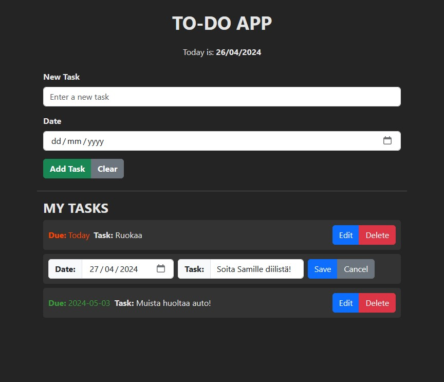

# TO-DO-APP
### Version: 1.00 , by FakeManiGH

A simple to-do app to keep track of your tasks.
 

## Overview
- Keep track of your tasks.
- Edit and delete tasks.
- Uses LOCAL STROAGE (local task memeory).
- No Licence, feel free to download.

## Dependencies
- Node.js
- React
- TypeScript
- React-bootstrap

Setup: https://vitejs.dev/guide/

